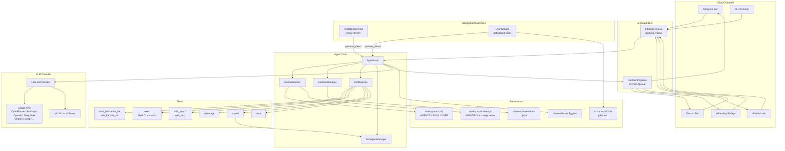
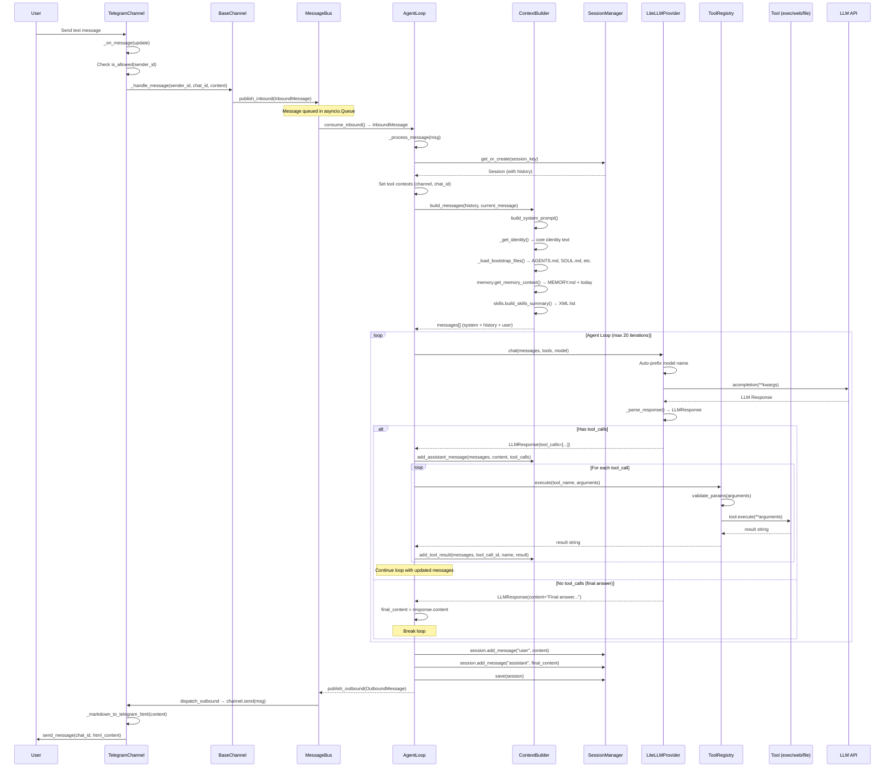
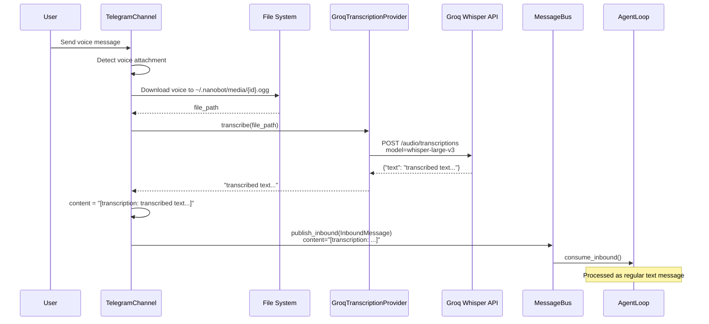
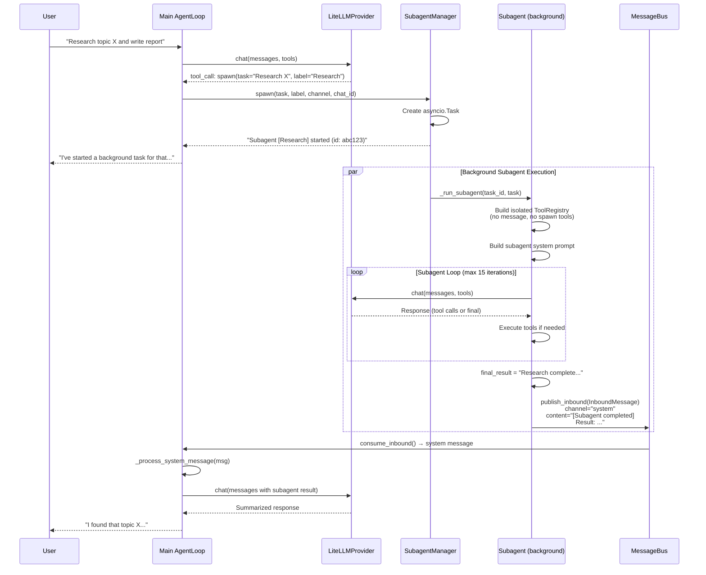
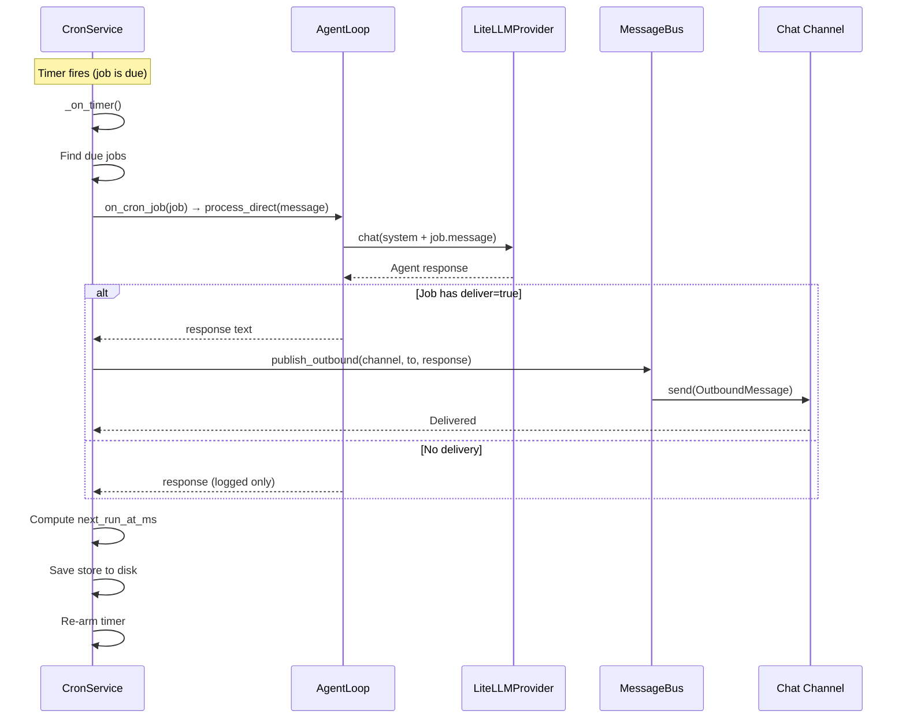
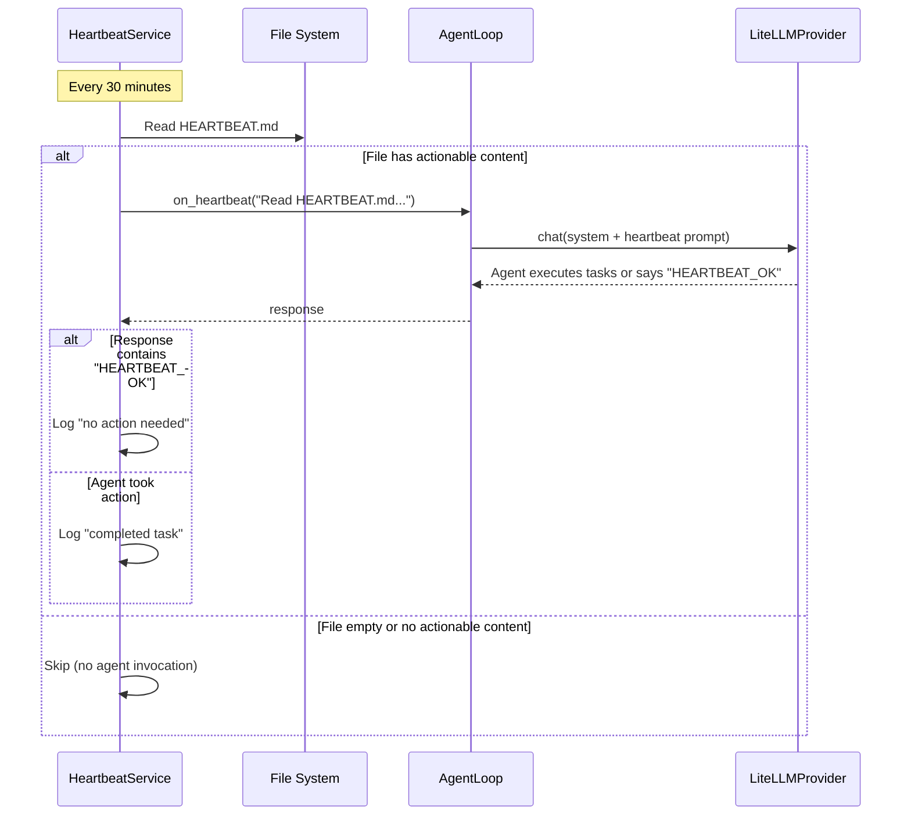
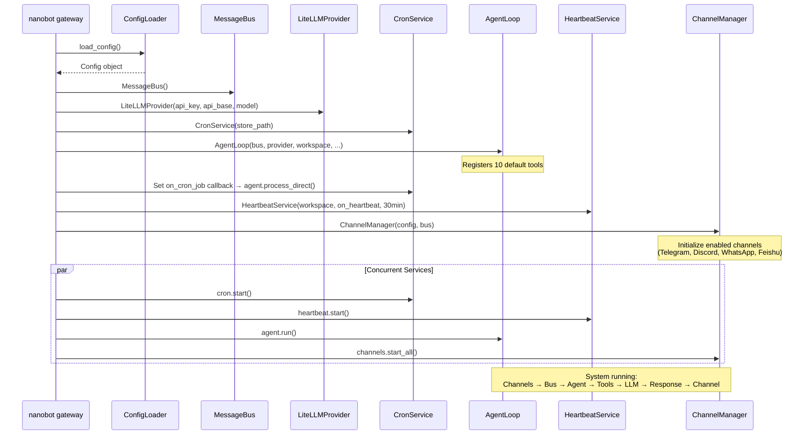
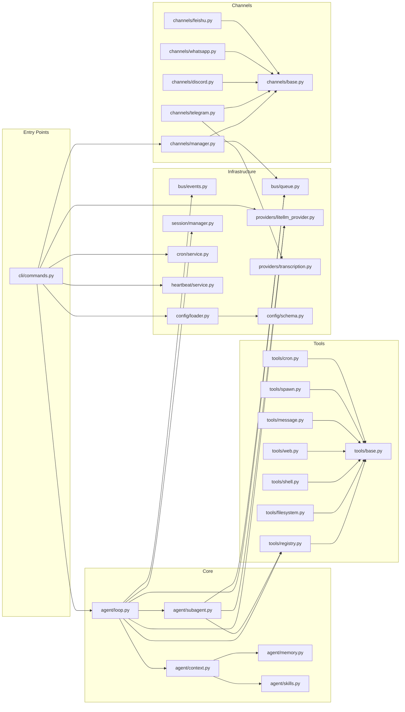

# NanoBot - Workflow & Data Flow Analysis

> **Repository:** [HKUDS/NanoBot](https://github.com/HKUDS/NanoBot)
> **Version analyzed:** v0.1.3.post4
> **Focus:** Sequence Diagrams (Mermaid), Pseudo-code, Data Flow Optimization

---

## 1. High-Level System Architecture Diagram



---

## 2. Request Processing Sequence Diagram

### 2.1 Text Message Flow (e.g., Telegram)



### 2.2 Image + Text Multimodal Flow

```mermaid
sequenceDiagram
    participant U as User
    participant TG as TelegramChannel
    participant FS as File System
    participant BUS as MessageBus
    participant AL as AgentLoop
    participant CB as ContextBuilder
    participant LP as LiteLLMProvider
    participant API as Vision LLM API

    U->>TG: Send photo with caption
    TG->>TG: _on_message(update)
    TG->>TG: Detect photo attachment
    TG->>TG: bot.get_file(photo.file_id)
    TG->>FS: Download to ~/.nanobot/media/{id}.jpg
    FS-->>TG: file_path

    TG->>BUS: publish_inbound(InboundMessage)<br/>content="caption text"<br/>media=["/path/to/image.jpg"]

    BUS->>AL: consume_inbound()
    AL->>CB: build_messages(history, message, media=[path])
    
    CB->>CB: _build_user_content(text, media)
    CB->>FS: Read image bytes
    CB->>CB: base64.b64encode(image_bytes)
    CB->>CB: Build multimodal content:
    Note over CB: [<br/>  {"type": "image_url", "image_url": {"url": "data:image/jpeg;base64,/9j/..."}},<br/>  {"type": "text", "text": "caption text"}<br/>]

    CB-->>AL: messages with multimodal user content

    AL->>LP: chat(messages, tools, model)
    LP->>API: acompletion(messages=[..., {content: [image + text]}])
    API-->>LP: Vision model response
    LP-->>AL: LLMResponse

    Note over AL: Standard tool-call loop continues...
```

### 2.3 Voice Message Flow



### 2.4 Subagent Spawn Flow



### 2.5 Cron Job Execution Flow



### 2.6 Heartbeat Service Flow



---

## 3. Gateway Startup Sequence



---

## 4. Pseudo-code for Core Functions

### 4.1 Main Agent Loop (`AgentLoop.run`)

```python
async def run(self):
    """Main event loop — consumes inbound messages and produces responses."""
    self._running = True
    
    while self._running:
        try:
            # Block until a message arrives (1s timeout for graceful shutdown)
            msg = await wait_for(bus.consume_inbound(), timeout=1.0)
        except TimeoutError:
            continue  # Check _running flag and loop
        
        try:
            response = await self._process_message(msg)
            if response:
                await bus.publish_outbound(response)
        except Exception as e:
            await bus.publish_outbound(error_response(msg, str(e)))
```

### 4.2 Message Processing (`AgentLoop._process_message`)

```python
async def _process_message(self, msg: InboundMessage) -> OutboundMessage:
    """Process a single user message through the agent loop."""
    
    # --- Phase 1: Context Setup ---
    session = sessions.get_or_create(msg.session_key)
    set_tool_contexts(msg.channel, msg.chat_id)  # message, spawn, cron tools
    
    # --- Phase 2: Prompt Assembly ---
    messages = context_builder.build_messages(
        history=session.get_history(max=50),
        current_message=msg.content,
        media=msg.media,         # Image paths for multimodal
        channel=msg.channel,
        chat_id=msg.chat_id,
    )
    # messages = [
    #   {"role": "system", "content": "<identity + bootstrap + memory + skills>"},
    #   {"role": "user", "content": "..."},   # history...
    #   {"role": "assistant", "content": "..."},
    #   {"role": "user", "content": "<current message or [image, text]>"},
    # ]
    
    # --- Phase 3: Agent Loop (ReAct-like) ---
    final_content = None
    
    for iteration in range(MAX_ITERATIONS):  # default: 20
        
        # Call LLM with current messages + tool definitions
        response = await provider.chat(
            messages=messages,
            tools=tool_registry.get_definitions(),  # OpenAI function format
            model=self.model,
        )
        
        if response.has_tool_calls:
            # ---- Tool Execution Phase ----
            # Add assistant message (with tool_calls metadata)
            messages.append({
                "role": "assistant",
                "content": response.content or "",
                "tool_calls": [
                    {"id": tc.id, "type": "function",
                     "function": {"name": tc.name, "arguments": json.dumps(tc.arguments)}}
                    for tc in response.tool_calls
                ]
            })
            
            # Execute each tool call sequentially
            for tool_call in response.tool_calls:
                result = await tool_registry.execute(tool_call.name, tool_call.arguments)
                # result is always a string (errors returned as "Error: ...")
                
                messages.append({
                    "role": "tool",
                    "tool_call_id": tool_call.id,
                    "name": tool_call.name,
                    "content": result,
                })
            
            # Continue loop — LLM will see tool results and decide next action
        
        else:
            # ---- Completion Phase ----
            final_content = response.content
            break  # No more tool calls → agent is done
    
    # --- Phase 4: Persistence ---
    if final_content is None:
        final_content = "I've completed processing but have no response to give."
    
    session.add_message("user", msg.content)
    session.add_message("assistant", final_content)
    sessions.save(session)  # Persist to JSONL file
    
    return OutboundMessage(
        channel=msg.channel,
        chat_id=msg.chat_id,
        content=final_content,
    )
```

### 4.3 System Prompt Builder (`ContextBuilder.build_system_prompt`)

```python
def build_system_prompt(self, skill_names=None) -> str:
    """Assemble the complete system prompt from multiple sources."""
    
    parts = []
    
    # 1. Core identity (role, time, runtime, workspace, behavioral rules)
    parts.append(get_identity_prompt())
    
    # 2. Bootstrap files from workspace (AGENTS.md, SOUL.md, USER.md, TOOLS.md)
    for filename in ["AGENTS.md", "SOUL.md", "USER.md", "TOOLS.md", "IDENTITY.md"]:
        if (workspace / filename).exists():
            parts.append(f"## {filename}\n\n{read(workspace / filename)}")
    
    # 3. Memory context (long-term + today's notes)
    memory_context = memory_store.get_memory_context()
    if memory_context:
        parts.append(f"# Memory\n\n{memory_context}")
    
    # 4. Always-loaded skills (full content included)
    always_skills = skills_loader.get_always_skills()
    if always_skills:
        parts.append(f"# Active Skills\n\n{load_full_content(always_skills)}")
    
    # 5. Available skills summary (agent loads on-demand via read_file)
    skills_xml = skills_loader.build_skills_summary()
    if skills_xml:
        parts.append(f"# Skills\n\n{skills_xml}")
    
    return "\n\n---\n\n".join(parts)
```

### 4.4 LiteLLM Provider Chat (`LiteLLMProvider.chat`)

```python
async def chat(self, messages, tools=None, model=None, max_tokens=4096, temperature=0.7):
    """Send chat completion request through LiteLLM abstraction."""
    
    model = model or self.default_model
    
    # Auto-prefix model name based on provider detection
    if is_openrouter and not model.startswith("openrouter/"):
        model = f"openrouter/{model}"
    elif is_vllm:
        model = f"hosted_vllm/{model}"
    elif is_aihubmix:
        model = f"openai/{model.split('/')[-1]}"
    # ... other provider-specific prefixing
    
    kwargs = {
        "model": model,
        "messages": messages,
        "max_tokens": max_tokens,
        "temperature": temperature,
    }
    
    if api_base:
        kwargs["api_base"] = api_base
    if extra_headers:
        kwargs["extra_headers"] = extra_headers
    if tools:
        kwargs["tools"] = tools
        kwargs["tool_choice"] = "auto"
    
    try:
        response = await litellm.acompletion(**kwargs)
        return parse_response(response)  # → LLMResponse
    except Exception as e:
        return LLMResponse(content=f"Error: {e}", finish_reason="error")


def parse_response(self, response) -> LLMResponse:
    """Parse LiteLLM response into standardized format."""
    choice = response.choices[0]
    
    tool_calls = []
    if choice.message.tool_calls:
        for tc in choice.message.tool_calls:
            tool_calls.append(ToolCallRequest(
                id=tc.id,
                name=tc.function.name,
                arguments=json.loads(tc.function.arguments),
            ))
    
    return LLMResponse(
        content=choice.message.content,
        tool_calls=tool_calls,
        finish_reason=choice.finish_reason,
        usage={...},
    )
```

### 4.5 Tool Execution (`ToolRegistry.execute`)

```python
async def execute(self, name: str, params: dict) -> str:
    """Execute a registered tool by name."""
    
    tool = self._tools.get(name)
    if not tool:
        return f"Error: Tool '{name}' not found"
    
    try:
        # Validate against JSON schema
        errors = tool.validate_params(params)
        if errors:
            return f"Error: Invalid parameters: {'; '.join(errors)}"
        
        # Execute tool
        return await tool.execute(**params)
    except Exception as e:
        return f"Error executing {name}: {str(e)}"
```

### 4.6 Subagent Execution (`SubagentManager._run_subagent`)

```python
async def _run_subagent(self, task_id, task, label, origin):
    """Execute subagent task in background and announce result."""
    
    # Build isolated tool set (no message, no spawn — prevents recursion)
    tools = ToolRegistry()
    tools.register(ReadFileTool(), WriteFileTool(), ListDirTool())
    tools.register(ExecTool(working_dir=workspace))
    tools.register(WebSearchTool(), WebFetchTool())
    
    # Focused system prompt
    system_prompt = f"""You are a subagent. Complete this task:
    {task}
    Rules: Stay focused, be concise, report findings."""
    
    messages = [
        {"role": "system", "content": system_prompt},
        {"role": "user", "content": task},
    ]
    
    # Independent agent loop
    for iteration in range(15):
        response = await provider.chat(messages, tools.get_definitions())
        
        if response.has_tool_calls:
            # Execute tools and continue
            add_tool_messages(messages, response)
        else:
            final_result = response.content
            break
    
    # Announce result back to main agent via message bus
    announce = InboundMessage(
        channel="system",
        sender_id="subagent",
        chat_id=f"{origin.channel}:{origin.chat_id}",
        content=f"[Subagent '{label}' completed]\nResult: {final_result}",
    )
    await bus.publish_inbound(announce)
```

---

## 5. Data Flow Optimization Analysis

### 5.1 Current Optimizations

| Optimization | Implementation | Impact |
|-------------|---------------|--------|
| **Progressive skill loading** | Only skill summaries in system prompt; full content loaded on-demand | Reduces base token count |
| **Session history windowing** | Last 50 messages only | Prevents context window overflow |
| **Output truncation** | Shell output capped at 10K chars | Prevents token waste on verbose output |
| **Web content extraction** | Readability library strips ads/nav | Reduces irrelevant content in context |
| **Memory partitioning** | Daily notes + long-term separation | Keeps memory context focused |
| **Heartbeat skip** | No LLM call if HEARTBEAT.md is empty | Zero unnecessary API calls |
| **Subagent isolation** | No message/spawn tools for subagents | Prevents infinite recursion |

### 5.2 Missing Optimizations (Opportunities)

| Opportunity | Current State | Potential Improvement |
|------------|--------------|----------------------|
| **Token counting** | None | Pre-count tokens to manage context budget |
| **Message summarization** | None | Summarize old history instead of truncating |
| **Parallel tool execution** | Sequential | Execute independent tool calls concurrently |
| **Streaming responses** | Not implemented | Stream partial responses for better UX |
| **Caching** | No LLM response caching | Cache deterministic tool outputs |
| **Embedding-based memory** | File-based only | Vector store for semantic memory retrieval |
| **Context compression** | None | Compress long tool outputs before sending to LLM |

---

## 6. Component Dependency Graph



---

## 7. Message Data Structures

### 7.1 InboundMessage (Channel → Agent)

```python
@dataclass
class InboundMessage:
    channel: str        # "telegram" | "discord" | "whatsapp" | "feishu" | "system" | "cli"
    sender_id: str      # User identifier (e.g., "12345|username")
    chat_id: str        # Chat/channel ID (e.g., "12345678")
    content: str        # Message text
    timestamp: datetime  # Message time
    media: list[str]    # Local file paths for images/audio
    metadata: dict      # Channel-specific data (message_id, is_group, etc.)
    
    @property
    def session_key(self) -> str:  # "telegram:12345678"
```

### 7.2 OutboundMessage (Agent → Channel)

```python
@dataclass
class OutboundMessage:
    channel: str        # Target channel
    chat_id: str        # Target chat/user
    content: str        # Response text (markdown)
    reply_to: str | None  # Message ID to reply to
    media: list[str]    # Media attachments
    metadata: dict      # Channel-specific options
```

### 7.3 LLM Message Format

```python
# System prompt
{"role": "system", "content": "<assembled system prompt>"}

# User text message
{"role": "user", "content": "What's the weather?"}

# User multimodal message
{"role": "user", "content": [
    {"type": "image_url", "image_url": {"url": "data:image/jpeg;base64,..."}},
    {"type": "text", "text": "What's in this image?"}
]}

# Assistant with tool calls
{"role": "assistant", "content": "", "tool_calls": [
    {"id": "call_123", "type": "function",
     "function": {"name": "web_search", "arguments": "{\"query\": \"weather today\"}"}}
]}

# Tool result
{"role": "tool", "tool_call_id": "call_123", "name": "web_search", "content": "Results: ..."}

# Final assistant response
{"role": "assistant", "content": "The weather today is sunny, 25°C."}
```

---

## 8. Complete Request Lifecycle Summary

```
┌──────────────────────────────────────────────────────────────────┐
│ 1. INPUT                                                         │
│    User sends message via Telegram/Discord/WhatsApp/CLI          │
│    → Channel handler downloads media, transcribes voice          │
│    → Creates InboundMessage, publishes to MessageBus             │
├──────────────────────────────────────────────────────────────────┤
│ 2. PREPROCESSING                                                 │
│    AgentLoop consumes message from bus                            │
│    → Loads/creates session (conversation history)                │
│    → Sets tool contexts (channel, chat_id for routing)           │
│    → ContextBuilder assembles system prompt:                     │
│      [Identity + Bootstrap files + Memory + Skills + Session]    │
│    → If image: base64-encode for multimodal content              │
├──────────────────────────────────────────────────────────────────┤
│ 3. INFERENCE LOOP (max 20 iterations)                            │
│    → Send messages + tool definitions to LLM via LiteLLM         │
│    → LLM returns either:                                         │
│      (a) tool_calls → execute tools → add results → LOOP        │
│      (b) text content → DONE                                    │
├──────────────────────────────────────────────────────────────────┤
│ 4. ACTION EXECUTION                                              │
│    For each tool call:                                           │
│    → Validate parameters against JSON schema                    │
│    → Execute tool (file I/O, shell, web, message, spawn, cron)  │
│    → Return result string to LLM                                │
│    Safety: deny patterns, workspace restriction, output truncation│
├──────────────────────────────────────────────────────────────────┤
│ 5. OUTPUT                                                        │
│    → Save conversation to session (JSONL)                        │
│    → Create OutboundMessage with final content                   │
│    → Publish to MessageBus outbound queue                        │
│    → ChannelManager dispatches to correct channel                │
│    → Channel formats (e.g., Telegram HTML) and sends             │
└──────────────────────────────────────────────────────────────────┘
```

---

## 9. Key Metrics

| Metric | Value |
|--------|-------|
| Total Python source files | ~30 |
| Total lines of code | ~3,422 |
| Core agent logic | ~1,200 LOC |
| Number of built-in tools | 10 |
| Number of chat channels | 4 (Telegram, Discord, WhatsApp, Feishu) |
| Number of LLM providers | 11 |
| Max agent loop iterations | 20 (main) / 15 (subagent) |
| Session history window | 50 messages |
| Shell output truncation | 10,000 chars |
| Web content truncation | 50,000 chars |
| Heartbeat interval | 30 minutes |
| Configuration format | JSON (camelCase ↔ snake_case auto-conversion) |
| Session storage format | JSONL |
| Memory storage format | Markdown files |
